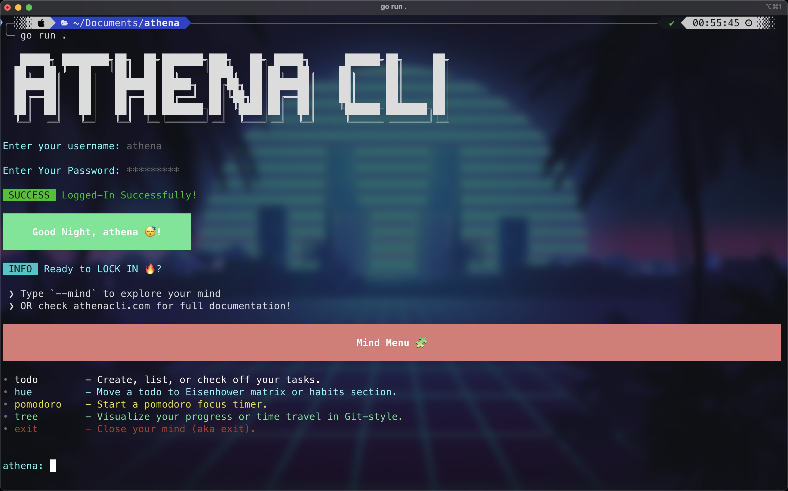
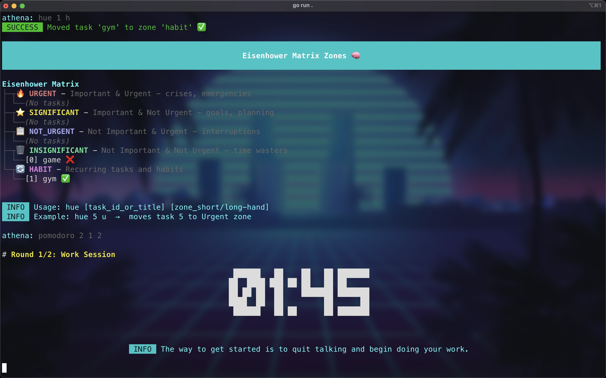

# 💎 Athena: Minimalist Productivity CLI

Athena is a ⚡ fast, 🎯 distraction-free command-line productivity suite built for CLI enjoyers with good taste and zero distractions.

-   Visual Eisenhower Matrix? ✅
-   Sexy Pomodoro timer? ⏳🔥
-   Powerful todo system? 📝 Boom.
-   Time travel / git-style? (Pending ...)

> 👑 _“Built in Go. Runs anywhere. Looks good doing it.”_

---

## ✨ Features

-   💡 **Eisenhower Matrix** — Prioritize like a boss with a color-coded, interactive quadrant-based CLI matrix.
-   ⏱️ **Pomodoro Timer** — Focus mode with motivating quotes & graceful Ctrl+C handling.
-   📋 **Todo List** — Clean, table-driven task manager with intuitive CLI commands.
-   🧠 **Seamless UX** — Consistent, helpful messages & no weird flags or surprises.

---

## 🧰 Technologies Used

-   🐹 **Go (Golang)** = Blazing-fast, cross-platform performance.
-   🐍 **Cobra** = CLI scaffolding made simple.
-   🎨 **pterm** = Beautiful terminal UI: tables, colors, banners, the works.



---

## 🚀 Getting Started

```bash
# 1. Clone the repo
git clone https://github.com/huevvn/athena.git
cd athena

# 2. Build it
go build -o athena

# 3. Run it
./athena hue            # Eisenhower Matrix
./athena pomodoro 25 5 3  # Pomodoro: 25min work, 5min break, 3 rounds
go run .                # running the loop logic
```

---

## 📝 Example Usage



-   **Eisenhower Matrix:**

    ```sh
    ./athena hue
    ./athena hue 0 h  # Move task 0 to Habit zone
    ```

-   **Pomodoro Timer:**
    ```sh
    ./athena pomodoro 25 5 4
    ```
-   **Todo List:**
    ```sh
    ./athena todo add "Write README"
    ./athena todo list
    ./athena todo t 0
    ```

---

## 📁 Project Structure

-   `cmd/` — CLI command definitions (Cobra)
-   `internal/hue/` — Eisenhower Matrix logic
-   `internal/pomodoro/` — Pomodoro timer logic
-   `internal/todo/` — Todo list logic

---

## ⚖️ License

Apache License 2.0. See [LICENSE](LICENSE) for details.

---

Athena: Minimalism for those who live in the terminal
